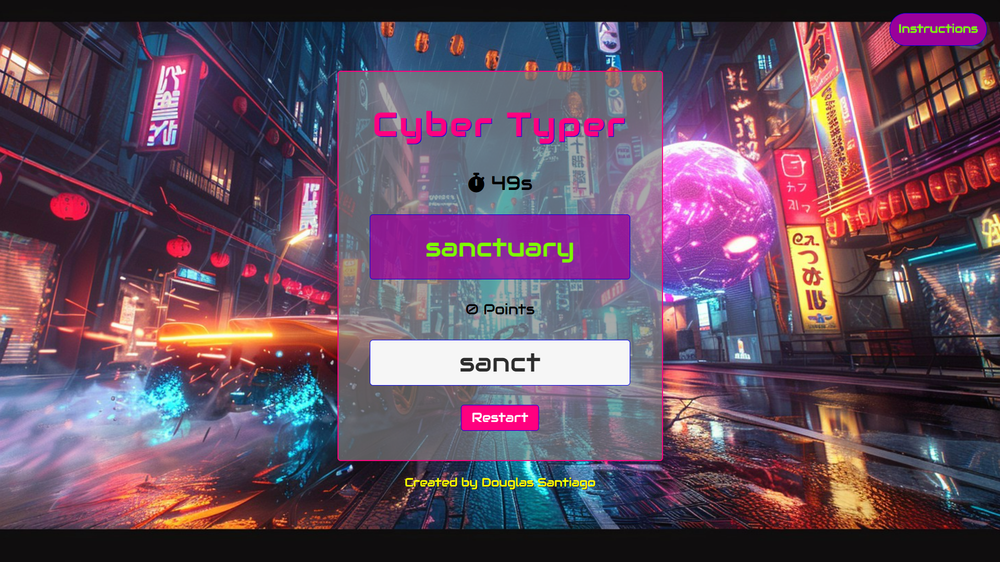
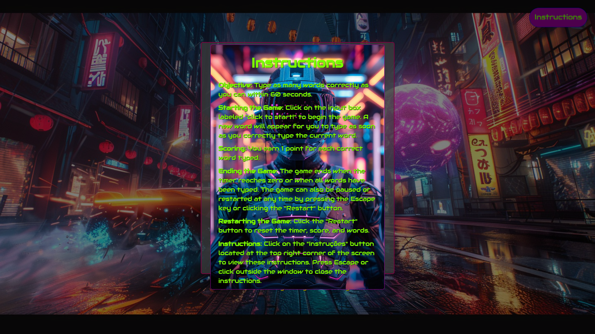

# Cyber typer application

Welcome to Cyber Typer, an exciting and fast-paced typing game designed to test 
your typing speed and accuracy! Dive into the futuristic world of Cyber Typer 
where you challenge yourself to type as many words as possible within a set 
time limit. Perfect for improving your typing skills while having fun!

Visit the website [here](https://douglasfssantiago.github.io/cyber-typer/) 



## Features 

* Dynamic Word Display: Randomly selected words appear for you to type.

* Real-time Scoring: Keep track of your progress with real-time scoring as you type each correct word.

* Countdown Timer: A 60-second timer keeps the game intense and fast-paced.

* Audio Feedback: Enjoy background music that sets the mood and audio cues for each correct word typed.

* Interactive UI: Start the game by clicking on the input box and restart 
effortlessly with the restart button.

* Instruction Modal: Access game instructions at any time by clicking the 
"Instruções" button.


 
## Get Started

**To run Cyber Typer locally:**

1. Clone the Repository: Open your terminal and clone the repository by running 
the following command:

```bash
git clone https://github.com/douglasfssantiago/cyber-typer.git
cd cyber-typer
```
2. Explore the Files: Once the repository is cloned, explore the different files 
and directories to understand the project structure.

3. Open the index.html File: Navigate to the project's root directory and locate 
the index.html file. Right-click on the index.html file and select 
`Reveal in File Explorer` (or the equivalent option in your file manager).

4. Run the Game: Double-click the index.html file to open it in your default 
web browser. Alternatively, you can open the index.html file in your preferred 
web browser by dragging and dropping it into the browser window.

By following these steps, you will be able to run Cyber Typer locally and start 
playing the game!
<br/>