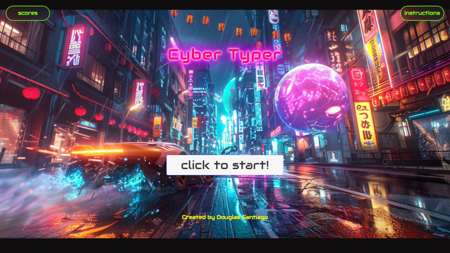
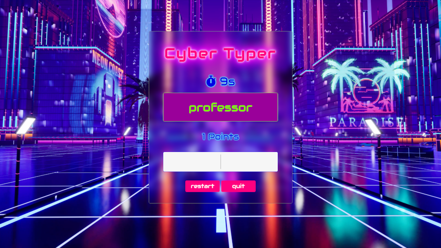
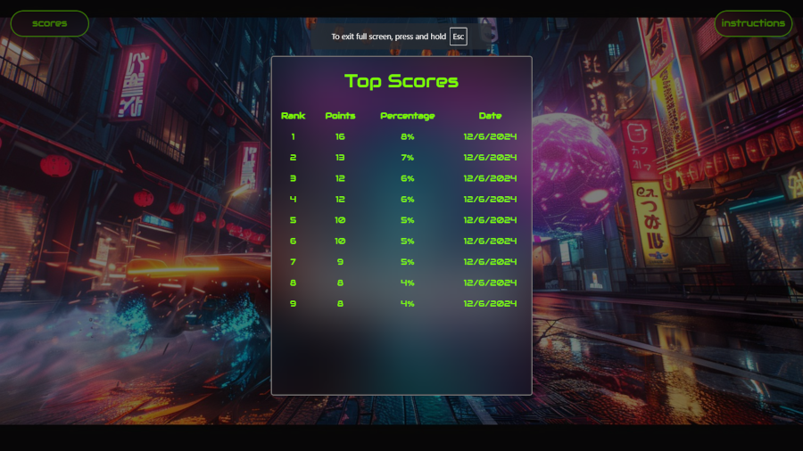

# Cyber typer

Cyber Typer is a word typing game where the player earns points by typing words correctly within a given time limit. The game displays the top scores and updates the scoreboard after each game.



## 🖥️Technologies Used


## Features 

* Word Typing Game: Type as many words as you can within the time limit to earn points.

* Scoreboard: Display the top 9 scores, including points, percentage, and date.

* Instructions: Detailed instructions on how to play the game and how the scoring system works.


 
## Get Started

**To run Cyber Typer locally:**

1. Clone the Repository:

```bash
git clone https://github.com/douglasfssantiago/cyber-typer.git
```

2. Navigate to the project directory:
```sh
cd cyber-typer
```

3. Open `index.html` in your browser to view the application.

## 🔗Project Demo
You can see the live demo of the project [here](https://douglasfssantiago.github.io/cyber-typer/).



&copy; Created by Douglas F S Santiago.
<br/>